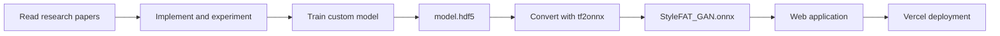

# Anime Face Generator — Style-Guided Face-to-Anime Translation

**An individual research project connecting paper study, model implementation, training, and a deployed web application.**

I developed this project to explore **Style-Guided Face-to-Anime Translation (StyleFAT)**: translating a photographic portrait into an anime-style face while preserving important aspects of the source image, such as pose and overall structure.

I studied multiple research papers, implemented model components, experimented with different architectures, and trained my own face-to-anime translation model from scratch. The resulting trained artifact is stored in [`model.hdf5`](model.hdf5). I later converted it to ONNX using **tf2onnx** and integrated it into an end-to-end web application.

**Author:** [Aryan Sehgal](https://github.com/AryanSehgal)

**[Research repository](https://github.com/AryanSehgal/anime-face-generator) · [Web application source](https://github.com/AryanSehgal/style-guided-face-to-anime-translation-app) · [Live demo](https://style-guided-face-to-anime-translat-ten.vercel.app/)**

## Contents

- [Project overview](#project-overview)
- [Research and experimentation](#research-and-experimentation)
- [Model architecture](#model-architecture)
- [Visual comparison](#visual-comparison)
- [Repository guide](#repository-guide)
- [Trained model artifacts](#trained-model-artifacts)
- [From research to a deployed application](#from-research-to-a-deployed-application)
- [Exploring and reproducing the experiments](#exploring-and-reproducing-the-experiments)
- [References](#references)
- [Author and acknowledgments](#author-and-acknowledgments)

## Project overview

Animation is widely used in entertainment, social media, and education. Automatically translating a real portrait into an anime-style image is an interesting image-to-image translation problem because it requires changes to both appearance and facial geometry.

The research objective is to preserve the global structure of a source portrait while adapting local facial features, colors, and textures to the style of a reference anime face. For example, anime-style eyes can differ substantially in shape and proportion from those in a photograph. A successful translation therefore needs to address more than surface-level color changes.

This repository contains the research and training work behind my custom StyleFAT model. The companion application repository contains the interface, inference service, and deployment configuration used to make the model accessible through a browser.

| Project stage | Contribution |
| --- | --- |
| Literature review | Studied work on GANs, image-to-image translation, content/style representations, and neural style transfer. |
| Implementation | Implemented and explored content encoders, style encoders, generators, and discriminators. |
| Experimentation | Compared architectural approaches and examined their visual behavior. |
| Training | Trained a custom model and saved the resulting artifact in HDF5 format. |
| Conversion | Converted the trained model to ONNX using tf2onnx. |
| Product development | Integrated the model into a web application with portrait input, generation, and comparison controls. |

## Research and experimentation

I approached this project as a sequence of research and implementation experiments. After reviewing multiple papers, I explored different content-encoder and style-encoder designs before developing the model components documented below.

The repository includes experiments explicitly inspired by **DRIT++** and **EGSC-IT**, alongside notebooks for content encoding, style encoding, generator development, and discriminator exploration. These notebooks document alternative approaches and intermediate work, rather than a single standardized training pipeline.

The architecture descriptions build on ideas from the cited literature. My contribution is the individual implementation, experimentation, model training, and subsequent application integration; the underlying research ideas remain credited to their original authors.

## Model architecture

### Generator design

I implemented a generator architecture designed to retain global information from the source portrait, such as pose, while transforming local facial features into anime-like shapes and transferring style-related colors and textures.

A central idea explored in this project is that **local facial shape can be treated as an aspect of style**, alongside color and texture. This makes style conditioning relevant to changes such as larger or rounder eyes, as well as changes in image appearance.

To explore this behavior, I investigated where to inject style information into the generator. Decoder feature maps represent information at different levels, from higher-level structure to lower-level texture. Conditioning multiple decoder levels provides a way to influence both facial shape and visual appearance.

<p align="center">
  
</p>

### Discriminator design

I also explored discriminator designs for learning distinctions between photographic and anime faces and for supporting the broader adversarial translation objective. The motivation is that both domains contain meaningful facial structure, even though their visual appearances differ.

The original architecture description includes a discriminator using pretrained VGG16 layers. The discriminator notebook also records experiments with a convolutional classifier and VGG19 feature extraction. These reflect different experimental approaches rather than one identical configuration throughout the project.

Training my custom translation model from scratch was part of this work; pretrained VGG feature extractors were also explored as components of the discriminator experiments.

<p align="center">
  
</p>

### Content encoder

The content encoder explores representations of the source portrait's structure. Its role is to retain information that should remain recognizable as the image is translated into the target domain.


### Style encoder

The style encoder explores how to represent target-domain appearance and use that representation to guide generation. The notebook contains multiple approaches to style representation and conditioning.


### Decoder

The decoder reconstructs an image from learned features. The research design investigates style conditioning at multiple feature levels to influence both local facial shape and lower-level appearance.


### Discriminator architecture

The following diagram preserves the discriminator architecture documented in the original project README.


## Visual comparison

The following figure presents the visual comparison included in the original project documentation.


This figure provides qualitative context. It should not be interpreted as a quantitative benchmark or a claim of state-of-the-art performance.

## Repository guide

| File | Purpose |
| --- | --- |
| [Content Encoders.ipynb](Content%20Encoders.ipynb) | Content-encoder experiments. |
| [Cycle Encoder.ipynb](Cycle%20Encoder.ipynb) | Additional encoder experimentation. |
| [DRIT++ Inspired Content Encoder.ipynb](DRIT%2B%2B%20Inspired%20Content%20Encoder.ipynb) | An encoder experiment inspired by disentangled representation research. |
| [EGSC-IT Inspired Content Encoder.ipynb](EGSC-IT%20Inspired%20Content%20Encoder.ipynb) | An alternative encoder/decoder experiment inspired by exemplar-guided translation research. |
| [Style Encoder.ipynb](Style%20Encoder.ipynb) | Style representation and conditioning experiments. |
| [Generator.ipynb](Generator.ipynb) | Generator development work. |
| [Discriminator.ipynb](Discriminator.ipynb) | Discriminator and feature-extraction experiments. |
| [model.hdf5](model.hdf5) | Trained artifact used in the subsequent model-conversion workflow. |
| [checkpoint/best.hdf5](checkpoint/best.hdf5) | Additional saved checkpoint. |

## Trained model artifacts

The main trained artifact is [`model.hdf5`](model.hdf5). This file connects the research project to the deployed application: I used it as the source artifact when converting the model to ONNX.

The repository also contains [`checkpoint/best.hdf5`](checkpoint/best.hdf5). These binary artifacts should be used with the appropriate model architecture, preprocessing, and framework environment from the training work.

The application-side export is available as [`models/StyleFAT_GAN.onnx`](https://github.com/AryanSehgal/style-guided-face-to-anime-translation-app/blob/main/models/StyleFAT_GAN.onnx).

## From research to a deployed application

After completing the model-development work, I extended the project into an end-to-end product. I converted the HDF5 model to ONNX with [tf2onnx](https://github.com/onnx/tensorflow-onnx), then integrated the exported model into a Node.js backend using ONNX Runtime.



### Related projects

| Resource | Link |
| --- | --- |
| Research and training repository | [anime-face-generator](https://github.com/AryanSehgal/anime-face-generator) |
| Web application repository | [style-guided-face-to-anime-translation-app](https://github.com/AryanSehgal/style-guided-face-to-anime-translation-app) |
| Live deployed application | [Open the face-to-anime application](https://style-guided-face-to-anime-translat-ten.vercel.app/) |
| Application documentation | [Setup, architecture, API, and deployment guide](https://github.com/AryanSehgal/style-guided-face-to-anime-translation-app#readme) |

### Application workflow

The application lets a user upload a portrait, capture a photo, or select a sample image. The backend preprocesses the image, executes the selected ONNX model, and returns the generated result for interactive comparison with the original.

The product uses **React and TypeScript** for the interface, **Express** for API handling, **Sharp** for image processing, and **ONNX Runtime** for CPU inference. It is deployed on **Vercel**.

The application currently offers a predefined model selector, including my custom StyleFAT model and separate Hayao/Paprika presets. Although the research explores reference-guided translation, the current web interface does not accept a separate reference anime image. Its inference grid is 512 × 512, with larger output sizes produced through resizing.

The original conversion script is not included in these repositories. Recreating the export requires matching the training model's dependencies and checking tensor names, dimensions, layout, and normalization against the application configuration. See the [application README](https://github.com/AryanSehgal/style-guided-face-to-anime-translation-app#readme) for the serving contract and current product limitations.

## Exploring and reproducing the experiments

Clone the research repository:

```bash
git clone https://github.com/AryanSehgal/anime-face-generator.git
cd anime-face-generator
```

Open the notebooks in Jupyter or another compatible notebook environment. Before running an experiment:

1. Review its imports and model definitions to identify the required dependencies.
2. Replace machine-specific dataset paths with the paths for your own environment.
3. Match the experiment's expected image dimensions and preprocessing.
4. Restore any required custom components and use compatible framework versions when loading saved artifacts.
5. Evaluate the output before changing the architecture or converting a model for deployment.

The notebooks include TensorFlow/Keras work and some PyTorch-based experimentation. They are research records, and the repository does not currently provide a pinned environment or one-command training setup. For running the finished application, follow the [web application's setup instructions](https://github.com/AryanSehgal/style-guided-face-to-anime-translation-app#run-locally).

## References

The following resources provide background on generative modeling, image-to-image translation, and style transfer. Listing a resource here does not imply that every method or dataset was used in the final trained model.

1. **AnimeFace2009.** [Dataset repository](https://github.com/nagadomi/animeface-2009).
2. **Danbooru2019.** [Dataset resource](https://www.gwern.net/Danbooru2019).
3. Jimmy Lei Ba, Jamie Ryan Kiros, and Geoffrey E. Hinton. **Layer Normalization.** arXiv:1607.06450, 2016.
4. Andrew Brock, Jeff Donahue, and Karen Simonyan. **Large Scale GAN Training for High Fidelity Natural Image Synthesis.** ICLR, 2019.
5. Kaidi Cao, Jing Liao, and Lu Yuan. **CariGANs: Unpaired Photo-to-Caricature Translation.** ACM Transactions on Graphics, 2018.
6. Hung-Jen Chen, Ka-Ming Hui, Szu-Yu Wang, Li-Wu Tsao, Hong-Han Shuai, and Wen-Huang Cheng. **BeautyGlow: On-Demand Makeup Transfer Framework with Reversible Generative Network.** CVPR, pp. 10042–10050, 2019.
7. Lei Chen, Le Wu, Zhenzhen Hu, and Meng Wang. **Quality-Aware Unpaired Image-to-Image Translation.** IEEE Transactions on Multimedia, 21(10), pp. 2664–2674, 2019.
8. Yang Chen, Yu-Kun Lai, and Yong-Jin Liu. **CartoonGAN: Generative Adversarial Networks for Photo Cartoonization.** CVPR, pp. 9465–9474, 2018.
9. Yunjey Choi, Minje Choi, Munyoung Kim, Jung-Woo Ha, Sunghun Kim, and Jaegul Choo. **StarGAN: Unified Generative Adversarial Networks for Multi-Domain Image-to-Image Translation.** CVPR, 2018.
10. Yunjey Choi, Youngjung Uh, Jaejun Yoo, and Jung-Woo Ha. **StarGAN v2: Diverse Image Synthesis for Multiple Domains.** CVPR, 2020.
11. Leon A. Gatys, Alexander S. Ecker, and Matthias Bethge. **A Neural Algorithm of Artistic Style.** arXiv:1508.06576, 2015.
12. Leon A. Gatys, Alexander S. Ecker, and Matthias Bethge. **Image Style Transfer Using Convolutional Neural Networks.** CVPR, pp. 2414–2423, 2016.
13. Ian Goodfellow, Jean Pouget-Abadie, Mehdi Mirza, Bing Xu, David Warde-Farley, Sherjil Ozair, Aaron Courville, and Yoshua Bengio. **Generative Adversarial Nets.** Advances in Neural Information Processing Systems, pp. 2672–2680, 2014.
14. Ishaan Gulrajani, Faruk Ahmed, Martin Arjovsky, Vincent Dumoulin, and Aaron C. Courville. **Improved Training of Wasserstein GANs.** Advances in Neural Information Processing Systems, pp. 5767–5777, 2017.
15. Bin He, Feng Gao, Daiqian Ma, Boxin Shi, and Ling-Yu Duan. **ChipGAN: A Generative Adversarial Network for Chinese Ink Wash Painting Style Transfer.** ACM Multimedia, pp. 1172–1180, 2018.
16. Martin Heusel, Hubert Ramsauer, Thomas Unterthiner, Bernhard Nessler, and Sepp Hochreiter. **GANs Trained by a Two Time-Scale Update Rule Converge to a Local Nash Equilibrium.** Advances in Neural Information Processing Systems, pp. 6626–6637, 2017.
17. Xun Huang and Serge Belongie. **[Arbitrary Style Transfer in Real-Time with Adaptive Instance Normalization](https://openaccess.thecvf.com/content_iccv_2017/html/Huang_Arbitrary_Style_Transfer_ICCV_2017_paper.html).** ICCV, pp. 1501–1510, 2017.
18. Phillip Isola, Jun-Yan Zhu, Tinghui Zhou, and Alexei A. Efros. **Image-to-Image Translation with Conditional Adversarial Networks.** CVPR, 2017.
19. Ting-Chun Wang, Ming-Yu Liu, Jun-Yan Zhu, Andrew Tao, Jan Kautz, and Bryan Catanzaro. **[High-Resolution Image Synthesis and Semantic Manipulation with Conditional GANs](https://openaccess.thecvf.com/content_cvpr_2018/html/Wang_High-Resolution_Image_Synthesis_CVPR_2018_paper.html).** CVPR, 2018.

### Additional research context and tooling

- [AniGAN: Style-Guided Generative Adversarial Networks for Unsupervised Anime Face Generation](https://arxiv.org/abs/2102.12593) — research context for the style-guided face-to-anime translation task.
- [DRIT++: Diverse Image-to-Image Translation via Disentangled Representations](https://arxiv.org/abs/1905.01270) — context for the DRIT++-inspired experiment.
- [Exemplar Guided Unsupervised Image-to-Image Translation with Semantic Consistency](https://arxiv.org/abs/1805.11145) — context for the EGSC-IT-inspired experiment.
- [tf2onnx](https://github.com/onnx/tensorflow-onnx) — conversion from TensorFlow/Keras to ONNX.
- [ONNX Runtime](https://github.com/microsoft/onnxruntime) — execution of the exported model in the web application.

## Author and acknowledgments

I am **[Aryan Sehgal](https://github.com/AryanSehgal)**, the individual developer of this project. I carried out the paper study, implementation experiments, custom model training, model conversion, and integration into the deployed web application.

I acknowledge the authors of the research papers and the maintainers of the datasets, frameworks, and tools that informed and supported this work. Their contributions provided the foundation for my learning, experimentation, and development.
